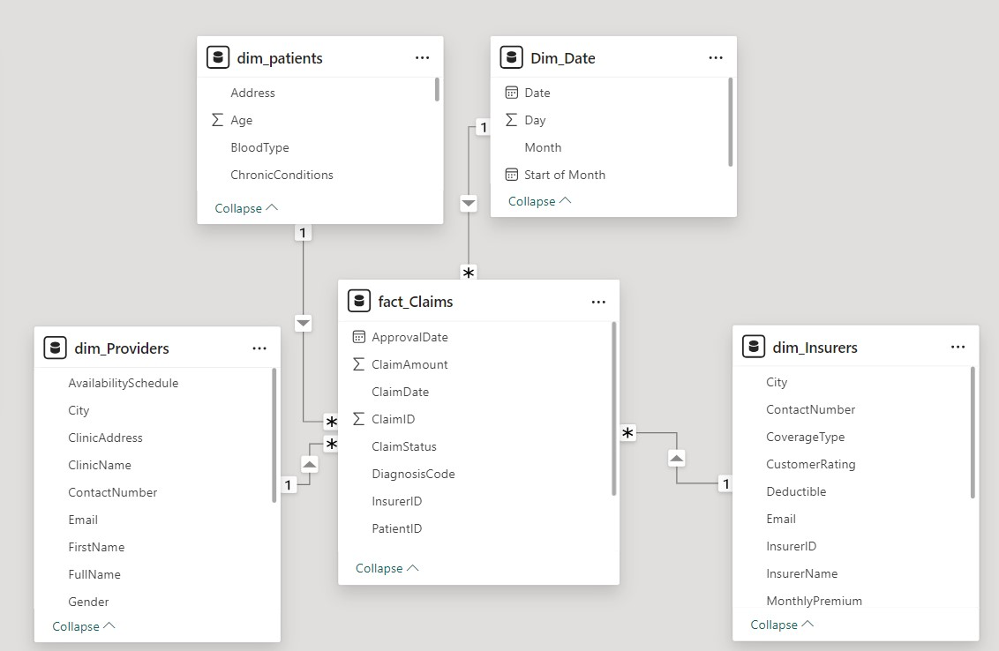

# Healthcare Claims Analysis Power BI Dashboard

This repository contains a Power BI report designed for analyzing healthcare claims data (mock data). The report utilizes a star schema model with data from the following tables:
- **Fact_Claims**: Contains detailed information about healthcare claims.
- **Dim_Patient**: Holds demographic and health-related data for patients.
- **Dim_Provider**: Contains details about healthcare providers.
- **Dim_Insurer**: Includes information about insurance providers.
- **Dim_Date**: A date dimension used for time-based analysis.

## File Contents
- **sample_report.pbix**: The Power BI report file.
- **mock_data.xlsx**: The mock data used for building the report.

## Embed Link:
- https://app.powerbi.com/reportEmbed?reportId=40112ffa-318f-4b9b-9b37-af067c3fcb00&autoAuth=true&ctid=e8ed0811-08f0-4e2a-8993-a37abd659e91

