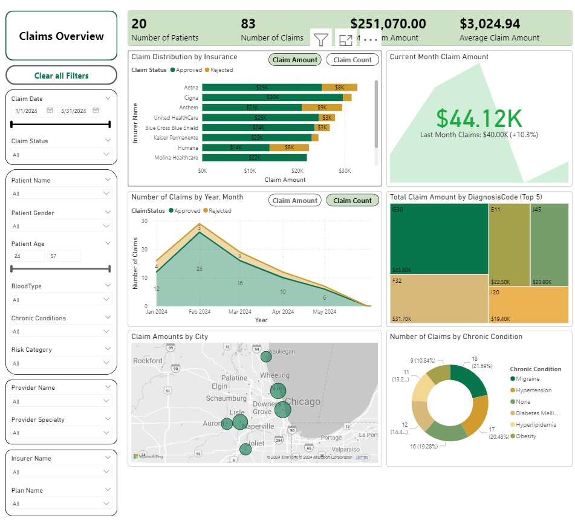

# Healthcare Claims Analysis Power BI Report

This repository contains a Power BI report designed for analyzing healthcare claims data (mock data). The report utilizes a star schema model with data from the following tables:
- **Fact_Claims**: Contains detailed information about healthcare claims.
- **Dim_Patient**: Holds demographic and health-related data for patients.
- **Dim_Provider**: Contains details about healthcare providers.
- **Dim_Insurer**: Includes information about insurance providers.
- **Dim_Date**: A date dimension (calculated table) used for time-based analysis.

## File Contents
- **sample_report.pbix**: The Power BI report file.
- **mock_data.xlsx**: The mock data used for building the report.

## Report Embed Link:
- https://app.powerbi.com/reportEmbed?reportId=40112ffa-318f-4b9b-9b37-af067c3fcb00&autoAuth=true&ctid=e8ed0811-08f0-4e2a-8993-a37abd659e91

## How to Use This Content

1. **Download the Files:** Download the `sample_report.pbix` and `mock_data.xlsx` files from this repository.
2. **Open the pbix file using Power BI Desktop:** You will need Power BI Desktop installed on your computer. Open Power BI desktop, navigate to "File" -> "Open" and select the `sample_report.pbix` file.
3. **Update Data Source:** From Home > click `Transform Data` to see the power query window. Click on each of the four queries (fact and dim tables) shown on the left side, one at a time, and update (double-click) the `Source` step from the listed `APPLIED STEPS` and update the file path to where you have stored the mock_data.xlsx. After updating the data source for all 4 tables, click `Close & Apply`.
4. **Interact with the Report:** The report provides various visualizations and filters to analyze healthcare claims data!

